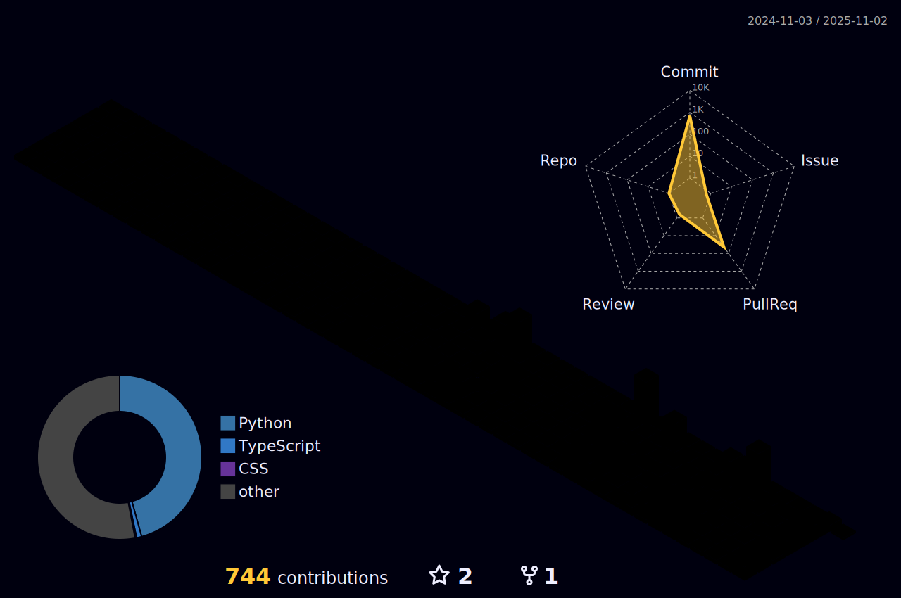

# 🚀 Welcome to My GitHub Repository!

## 안녕하세요, 저는 SeoHyun Kim입니다. 

## 🏃‍♂️ 현재 진행 활동
- 한양대학교 인공지능학회 HYAI 1~2기 초대회장
- Singularity LLC 대표 이사

## 🎖 주요 수상 경력

| 연도 | 대회명 | 수상/순위 | 수여 기관 |
|------|--------|----------|------------|
| 2023 | SW중심대학 공동해커톤 | 1위 대상 | 과학기술정보통신부 장관상 |
| 2023 | 초광역 GPT-AI 활용 창업 경진대회 | 1위 대상 | 마이크로소프트 대표이사상/동국대학교 총장상 |
| 2023 | 대학생 창작 모빌리티 경진대회 자율주행 성능부문 | 신인 1위 베스트루키상 | KASA 자동차안전공학회 회장상 |
| 2023 | 해동 창업 경진대회 학생부 | 2위 우수상 | LINC 3.0 사업단장상 |
| 2023 | 2023-2 SID Audition 원페이퍼 창업경진대회 | 2위 우수상 | 창업교육센터장상 |
| 2023 | 제 10회 대한민국 SW융합 해커톤 자유주제 부문 | 2위 우수상 | 세종특별자치시장상 |
| 2023 | 전국 대학생 SW 창업 아이디어톤 | 1위 대상 | 한양대학교 총장상 |
| 2023 | 한양대학교 제 11회 SW 창업 아이디어톤 경진대회 | 1위 대상 | 한양대학교 총장상 |
| 2023 | 폭스바겐 SEA:ME Summer Hackathon | 동상 | 폭스바겐코리아 CEO상/국민대학교 총장상 |
| 2023 | 공학대학 학술제 | 1위 대상 | 한양대학교 공학대학 학장상 |
| 2023 | 한양대학교 포트폴리오 경진대회 | 1위 | 소프트웨어융합대학 학장상 |
| 2023 | 창업 우수상 | | 한양대학교 SW중심대학사업단장상 |
| 2023 | SID Audition 원페이퍼 창업경진대회 | SID상 | 창업교육센터장상 |
| 2023 | IC-PBL 커리어로드맵 콘테스트 | 우수상 | 한양인재개발원장상 |
| 2022 | 국제 창작 자동차 경진대회 자율주행 미션 | 1위 특별상 | TS한국교통안전공단 이사장상 |
| 2022 | 한양대학교 포트폴리오 경진대회 | 2위 | 소프트웨어융합대학 학장상 |
| 2021 | JDC Youth AI Olympiad | 1위 | JDC 이사장상 |
| 2021 | 청소년 AI 융합아카데미 | 성적우수상 | 교육감상 |
| 2020 | 공학아카데미 우수연구상 | | 제주대학교 공과대학 학장상 |
| 2020 | 소프트웨어 동아리 산출물 대회 | 3위 | 교육감상 |

## 👨‍💻 주요 활동 경력

| 연도 | 활동 내용 |
|------|------------|
| 2023 | 한양대학교 Baqu4 자작자동차학회 자율주행팀 팀장 |
| 2023 | LG Aimers 2기 수료 / DACON 연계 해커톤 (32등/1006명) |
| 2023 | 제 1회 HYAI X 한양대학교 'HYAI Challenge' 인공지능 경진대회 주최 및 성료 |
| 2023 | 제 1회 수도권 대학 연합 인공지능 경진대회 주최 및 성료 |
| 2022 | 한양대학교 인공지능학회 HYAI 'HanYang Artificial Intelligence' 초대회장 |
| 2022 | 한양대학교 자작자동차학회 Baqu4 자율주행 인지팀, 판단팀 기여 |
| 2022 | 한양대학교 휴아로 전공알림단 9기 멘토 수료 |
| 2021 | 청소년 AI 융합아카데미 수료 |
| 2020 | NAVER NSML/KERIS AI Hackathon 완주 |
| 2020 | DSA-CS(Data Science Ambassadors Computer Science) 수료 |

## 💻 Baekjoon Online Judge
<!-- 여기에 자신의 백준 온라인 저지 티어를 삽입하세요. -->

---

🔭 현재 다양한 프로젝트에 참여하고 있습니다.

💬 저에게 궁금한 점이 있다면 언제든지 이슈를 생성해주세요.

📫 연락은 이메일로 해주세요: [tjgus5569@hanyang.ac.kr](mailto:tjgus5569@hanyang.ac.kr)

감사합니다!
